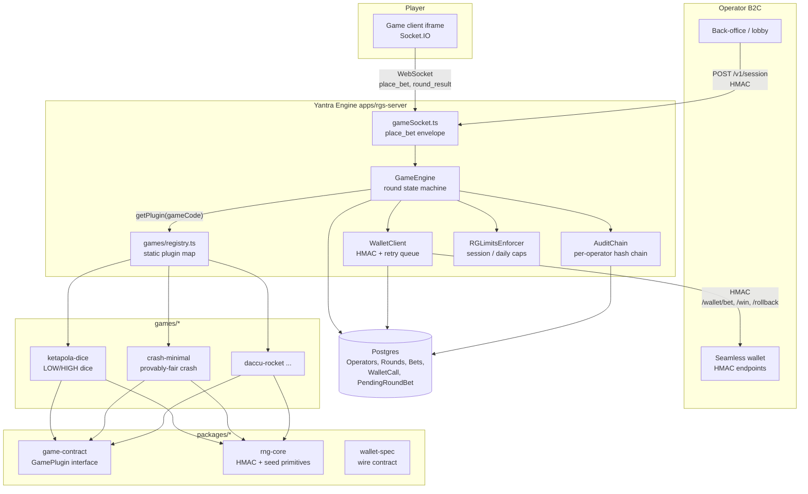

<div align="center">

# Yantra Gaming

### Multi-tenant Remote Gaming Server for B2B iGaming

A plugin-based RGS where operators plug in their wallet and this server runs the rounds: the game loop, the RNG, and the audit ledger.

[](https://dinethlive.github.io/yantra-gaming/)
[](#tech-choices)
[](./LICENSE)

**[Documentation site](https://dinethlive.github.io/yantra-gaming/)** · [Integration guide](./docs/integration-guide.md) · [Wallet API](./docs/wallet-api.md) · [Provably fair](./docs/provably-fair.md) · [Changelog](./CHANGELOG.md) · [Security](./SECURITY.md)

</div>

---

<details>
<summary><b>Table of contents</b></summary>

- [What this is](#what-this-is)
- [The plugin contract](#the-plugin-contract)
- [Repo layout](#repo-layout)
- [How a round flows](#how-a-round-flows)
- [Architecture](#architecture)
- [Writing a new game](#writing-a-new-game)
- [Running locally](#running-locally)
- [Tests](#tests)
- [Where things live](#where-things-live)
- [Scope](#scope)
- [Reference frontends](#reference-frontends)
- [Docs](#docs)
- [Tech choices](#tech-choices)
- [Changelog / License / Security](#changelog--license--security)

</details>

## What this is

An RGS is the half of an online casino that owns the **game loop, the RNG, and the audit ledger**, the part a regulator certifies and a cert lab signs off on. The other half (the wallet, player identity, KYC, deposits, bonuses, responsible-gambling policy) belongs to the operator, the B2C-facing casino brand. Player bets arrive over a signed wire contract; outcomes come back the same way.

Yantra is shaped like the commercial providers this category runs on (Stake Engine, Hacksaw OpenRGS, Pragmatic's game math SDK): one server core, many game plugins.

| Game | Shape | Status |
| :--- | :--- | :--- |
| **Ketapola Dice** | Sri Lankan dice, LOW/HIGH weighted outcome, 2× payout | First shipped plugin |
| **Crash Minimal** | Provably-fair crash, HMAC to `1/(1 − u)` multiplier | Reference plugin proving a different outcome shape |
| **Lempi Crash** | HNL-only live crash with two bet slots and manual/auto cashout | In development |

Adding a game is a workspace directory plus one line in the registry; the engine, the wallet, the audit ledger, and the compliance surface do not move.

## The plugin contract

Every game implements `GamePlugin<TSelection, TOutcome, TConfig>` from `packages/game-contract`:

```ts
interface GamePlugin<TSelection, TOutcome, TConfig> {
  readonly gameCode: string;              // 'ketapola-dice' | 'crash-minimal' | ...
  readonly displayName: string;
  readonly cert: CertAttestation;         // rngVersion, GLI category, math version
  readonly selectionSchema: z.ZodType<TSelection>;
  readonly configSchema: z.ZodType<TConfig>;
  readonly defaultConfig: TConfig;
  readonly sampleSelection: TSelection;

  computeOutcome(ctx: RngContext, config: TConfig): TOutcome;
  verifyOutcome(ctx: RngContext, config: TConfig, claimed: TOutcome): boolean;
  settleBet(req: { selection, amountMicro, outcome, config, commissionMicro }): SettlementResult;
  outcomeForWire(outcome: TOutcome): { outcomeType: string; outcome: unknown };
}
```

> **The engine** owns state, bets, the wallet, the audit chain, the RG limits.
> **The plugin** owns math.

## Repo layout

```
yantra-gaming/
├── apps/
│   ├── rgs-server/          Express + Socket.IO + Prisma. Engine, wallet, admin API, Prometheus /metrics.
│   ├── mock-operator/       Fake casino + fake wallet. Drives the RGS over the real HMAC contract.
│   ├── game-client/         Reference PixiJS player iframe. Session handshake, socket round lifecycle, per-game UI.
│   ├── operator-portal/     Reference React admin. Rounds, wallet-call audit, per-game config, reports, credential rotation.
│   └── provider-admin/      Yantra-staff platform admin UI (operator onboarding, cross-tenant oversight).
├── packages/
│   ├── game-contract/       GamePlugin interface, discriminated outcome union, cert attestation types.
│   ├── rng-core/            Shared provably-fair primitives (seed pair, HMAC, verify). Game-agnostic.
│   ├── wallet-spec/         Wire contract between RGS, SDK, and operator.
│   ├── operator-sdk/        What operators install to integrate: createSession, verifyWebhook.
│   ├── jurisdiction-rules/  Bet-time regulatory rules (UK/DE/ON autoplay bans, spin-speed floors).
│   └── webhook-spec/        Outbound webhook event shapes (round.settled, session.terminated, …).
├── games/
│   ├── ketapola-dice/       First game: Sri Lankan dice, LOW/HIGH weighted outcome, 2× payout.
│   └── crash-minimal/       Second game: provably-fair crash, HMAC to 1/(1 − u) multiplier.
└── tests/
    ├── games/               Per-game RTP regressions + RNG test vectors.
    ├── plugin-contract/     Conformance harness. Runs six checks on every registered plugin.
    ├── integration/         Money-safety specs (idempotency, rollback, timeout, settlement-crash).
    └── e2e/                 End-to-end mock-operator flow.
```

## How a round flows

```
1. Operator POSTs /v1/session → RGS mints a session JWT + launch URL.
2. Player browser loads the game iframe, connects via Socket.IO with the JWT.
3. RGS emits `round_state { phase: BETTING_OPEN, serverSeedHash, clientSeed }`.
4. Player sends `place_bet { amountMicro, selection }`.
     - Socket layer validates the envelope (amount shape, autoplay flags).
     - Plugin's `selectionSchema` validates the selection (e.g. dice: {side:'LOW'|'HIGH'}).
     - Engine runs RG-limit enforcement, writes the Bet row, calls operator /wallet/bet (HMAC-signed).
     - On success, a PendingRoundBet row is opened: the GLI-19 §3 incomplete-games register.
5. Betting window closes. Engine calls plugin.computeOutcome(ctx, config).
     - ctx = { serverSeed, clientSeed, nonce }. Outcome is deterministic, verifiable ex-post.
     - Outcome stored as `{ outcomeType, outcomeData }` JSONB on the Round row.
6. For each accepted bet, engine calls plugin.settleBet(...) → operator /wallet/win.
     - Failed wins enqueue a PendingWalletJob (durable retry; never-lose-money).
7. Engine emits round.settled webhook. Seed rotates per session TTL.
```

Every step writes a tamper-evident `WalletCall` audit row and links into a per-operator hash chain (`services/AuditChain.ts`). Daily `AuditAnchor` signs the tip with a long-lived secret; a regulator can spot-verify any historical row against a signed anchor.

## Architecture



See [`docs/architecture.md`](./docs/architecture.md) for C4-level diagrams, state machines, and sequence diagrams.

## Writing a new game

Five files in a new workspace directory, one line in the registry. No schema migration, no engine changes.

```
games/your-game/
├── package.json              {"name": "@yantra-games/your-game", ...}
├── tsconfig.json
└── src/
    ├── config.ts             zod schema for OperatorGameConfig.configJson + defaultConfig
    ├── selection.ts          zod schema for the bet-side payload
    ├── outcome.ts            computeOutcome, verifyOutcome, RNG_VERSION = 'your-game-rng-v1'
    ├── settle.ts             win/loss + payout math
    └── index.ts              default export: the GamePlugin instance
```

`apps/rgs-server/src/games/registry.ts`:

```ts
import yourGame from '@yantra-games/your-game';

const plugins: Record<string, GamePlugin> = {
  [ketapolaDice.gameCode]: ketapolaDice,
  [crashMinimal.gameCode]: crashMinimal,
  [yourGame.gameCode]: yourGame,              // ← added
};
```

The conformance harness (`tests/plugin-contract/plugin-conformance.spec.ts`) automatically picks up the new plugin and runs six checks against it:

1. `selectionSchema` accepts `sampleSelection`, rejects garbage.
2. `configSchema.parse(defaultConfig)` round-trips.
3. `computeOutcome` is deterministic.
4. `verifyOutcome(ctx, config, computeOutcome(ctx, config))` returns true.
5. `cert.rngVersion` matches `<gameCode>-rng-vN`.
6. `outcomeForWire(o).outcomeType === o.type`.

CI `rng-change-gate` auto-demands `CERT-ATTEST-YOUR_GAME:` in PR descriptions for any commit that touches `games/your-game/src/{outcome,settle,config}.ts`. This is the same pattern providers use to file per-game re-attestation with GLI.

## Running locally

```bash
bun install
docker compose up -d                       # Postgres on 5434
cp .env.example .env
cd apps/rgs-server && bunx --bun prisma migrate dev
bun run db:seed                            # seeds one operator + both game configs
cd ../.. && bun run dev:core               # rgs-server (4500) + mock-operator (4300)
```

Switch the mock operator between games with the env var:

```bash
MOCK_OPERATOR_GAME_CODE=ketapola-dice bun run dev:core     # default
MOCK_OPERATOR_GAME_CODE=crash-minimal bun run dev:core
```

| Endpoint | Purpose |
| :--- | :--- |
| `http://localhost:4500/healthz` | RGS liveness |
| `http://localhost:4500/metrics` | Prometheus metrics |
| `http://localhost:4300/wallet` | Mock operator wallet |

## Tests

```bash
bun test                                   # all (unit + integration; Postgres required)
bun test tests/plugin-contract             # conformance harness: 13 tests × N plugins
bun run test:math                          # per-game RTP regressions + RNG vectors
bun test tests/integration                 # money-safety specs
bun run load                               # k6 load test (requires k6)
```

Critical integration specs (need Postgres, all under `tests/integration/`):

| Spec | What it proves |
| :--- | :--- |
| `settlement-failure.spec.ts` | Kill the server mid-round, restart, observe exactly one `/wallet/win` call per unresolved winning bet. No duplicates, no misses. |
| `idempotency.spec.ts` | Two POSTs with the same `requestUuid` return the cached response; side effects fire once. |
| `timeout-retry.spec.ts` | Operator returns 503, 503, 200, and the bet still settles via the retry queue with monotonically increasing attempt counts. |
| `wallet-rollback.spec.ts` | Rollback retries are no-ops at the operator; RGS records the retry count. |

The RTP regression simulates 1M rounds by default (10M with `RTP_REGRESSION_FULL=1`) and asserts observed RTP within ±0.5% of theoretical. It is the signal a cert lab actually checks.

## Where things live

| File | What it does |
| :--- | :--- |
| `apps/rgs-server/src/services/GameEngine.ts` | Round state machine, wallet orchestration, plugin delegation. |
| `apps/rgs-server/src/services/EngineRegistry.ts` | Per-(operator, game, currency) engine lifecycle. Looks up the plugin, validates `configJson`. |
| `apps/rgs-server/src/games/registry.ts` | Static plugin map. Where new games plug in. |
| `apps/rgs-server/src/wallet/WalletClient.ts` | Audit-logged, circuit-broken wallet calls. |
| `apps/rgs-server/src/wallet/HttpWalletAdapter.ts` | HMAC-signed outbound; timeout triggers synthetic rollback. |
| `apps/rgs-server/src/services/PendingJobRunner.ts` | Durable retry queue for failed wins + rollbacks. |
| `apps/rgs-server/src/services/AuditChain.ts` | Tamper-evident hash chain, daily signed anchors. |
| `apps/rgs-server/src/services/RGLimitsEnforcer.ts` | Per-session / daily caps + jurisdictional rules. |
| `apps/rgs-server/prisma/schema.prisma` | Multi-tenant schema. `operatorId` FK on every domain row. |
| `packages/rng-core/src/index.ts` | Seed pair, HMAC, verify. Shared across every game. |
| `packages/game-contract/src/index.ts` | `GamePlugin` interface + `GameOutcome` discriminated union. |
| `games/ketapola-dice/src/outcome.ts` | Dice math: LOW/HIGH weighted selection, 6 faces. |
| `games/crash-minimal/src/outcome.ts` | Crash math: `floor(100/(1 − u))/100` with pre-roll bust. |
| `tests/plugin-contract/plugin-conformance.spec.ts` | Six architectural invariants, enforced per plugin. |
| `tests/games/ketapola-dice/rtp-regression.spec.ts` | Ketapola RTP simulation. |
| `tests/games/crash-minimal/rtp-regression.spec.ts` | Crash RTP convergence at 2×/5×/20× cashouts. |
| `.github/workflows/ci.yml` | Per-game `CERT-ATTEST` gate + typecheck + migrate + tests. |

## Scope

> **Inside the RGS boundary**
>
> Multi-tenant RGS, seamless-wallet HTTP integration, commit-reveal provably-fair RNG, crash-safe round state machine, durable retry queue, GLI-19 §3 `PendingRoundBet` register, admin/platform APIs, reconciliation CLI, OpenTelemetry observability, change-gated per-game RNG with RTP regression in CI.

> **Outside the RGS boundary (operator responsibilities)**
>
> Player authentication, KYC, AML, deposits, withdrawals, bonus engine, marketing pixels. Responsible-gambling *policy* is operator-owned; the RGS *enforces* the per-session limits delivered via the session JWT.

> **Alongside the codebase (operational milestones, not in-repo)**
>
> Jurisdictional licensing (Curaçao B2B Critical Supplier, Malta MGA, UKGC, …), cert-lab submission (iTech Labs / BMM / GLI-11 / GLI-19), ISO 27001, SOC 2 Type II, data residency, MiCA / FATF for crypto configurations. The engineering artefacts each of these programs consumes (RNG source + spec, PAR sheet, change-management policy, threat model, audit ledger, observability evidence) ship here; the submissions and sign-offs are tracked in [`B2B_ROADMAP.md`](./B2B_ROADMAP.md) §16.

## Reference frontends

The **core RGS backend** is the integration surface every operator must consume, and the only component whose wire format is part of the SLA. Alongside it, this repo ships reference frontends so the full system is runnable end-to-end:

| Component | What it is |
| :--- | :--- |
| Player iframe (`apps/game-client`) | PixiJS reference game client. Session-token handshake, socket-based round lifecycle, i18n, animation. Per-game subdirectories mirror `games/`. |
| Operator back-office (`apps/operator-portal`) | React reference admin: rounds, wallet-call audit, per-game config with audit log, reports, credential rotation. Builds on `routes/admin.ts`. |
| Provider admin (`apps/provider-admin`) | Yantra-staff platform UI: operator onboarding, credential lifecycle, cross-tenant oversight. |

Operators can run these as-is, white-label the player iframe, or build their own UI directly against the documented admin API. The backend wire contract is what binds the SLA, not the UI.

## Docs

**Live site:** [dinethlive.github.io/yantra-gaming](https://dinethlive.github.io/yantra-gaming/)

Docs split by cert scope. **Platform-wide** docs stay in `docs/`, **per-game** cert packets live with their plugin at `games/<code>/docs/`. This matches the GLI-19 (platform) vs GLI-11 (per-game) submission boundary and keeps each game's cert packet self-contained alongside the code it certifies.

Everything is rendered by **MkDocs + Material** (same stack as Stake Engine). `mkdocs.yml` sits at the repo root, CI builds via `.github/workflows/docs.yml`, and deploys to GitHub Pages on every push to `main`. Preview locally:

```bash
# one-time: install uv (fast Python runner) from https://astral.sh/uv
bun run docs:serve    # → http://127.0.0.1:8000
bun run docs:build    # → ./site (strict build, matches CI)
```

Toolchain is pinned in `requirements-docs.txt`. Bumping MkDocs or Material is a docs-only change with no cert-attestation gate.

### Platform docs (`docs/`), GLI-19 scope, one copy for the whole RGS

| Doc | Scope |
| :--- | :--- |
| [`architecture.md`](./docs/architecture.md) | C4 context + container diagrams, state machines, sequences, ER. |
| [`integration-guide.md`](./docs/integration-guide.md) | Operator devs, zero to working session in 30 minutes. |
| [`wallet-api.md`](./docs/wallet-api.md) | Canonical wallet contract: request/response shapes, retry rules. |
| [`webhook-signature.md`](./docs/webhook-signature.md) | Outbound event signing: canonical string + canonical JSON + verification recipe. |
| [`openapi.yaml`](./docs/openapi.yaml) | Machine-readable OpenAPI 3.1 spec for all routes + webhooks. |
| [`integration-test-vectors.md`](./docs/integration-test-vectors.md) | Hand-computed signature / session / proof fixtures. |
| [`sandbox.md`](./docs/sandbox.md) | Local mock-operator, headless e2e harness, hosted sandbox (v1.1). |
| [`fx-and-currency.md`](./docs/fx-and-currency.md) | Single-currency sessions, multi-currency FX at bet time, crypto / stablecoins. |
| [`provably-fair.md`](./docs/provably-fair.md) | Shared commit-reveal scheme + end-user verifier (20-line JS) + entropy monitoring. |
| [`error-codes.md`](./docs/error-codes.md) | Every `RS_*` status code, when it fires, how to handle it. |
| [`change-management.md`](./docs/change-management.md) | Per-scope re-cert policy (`CERT-ATTEST-CORE`, `CERT-ATTEST-<GAMECODE>`). |
| [`cert-submission-checklist.md`](./docs/cert-submission-checklist.md) | GLI-11 / GLI-19 packet inventory, per-lab notes. |
| [`threat-model.md`](./docs/threat-model.md) | STRIDE + LINDDUN (privacy), mitigations traced to code. |
| [`security.md`](./docs/security.md), [`incidents.md`](./docs/incidents.md), [`runbook.md`](./docs/runbook.md) | Signing + replay + HSM/KMS + CSP bootstrap, incident playbooks, day-2 ops. |
| [`observability.md`](./docs/observability.md) | Metrics, traces, alert rules, RTP drift monitor, SIEM integration. |

### Per-game cert packets (`games/<code>/docs/`), GLI-11 scope, one set per plugin

| Doc | Scope |
| :--- | :--- |
| `game-rules.md` | Authoritative rules (player-facing + cert-submission). |
| `par-sheet.md` + `par-sheet.json` | Game math: outcomes, probabilities, RTP, house edge, volatility. |
| `rng-spec.md` | Game-specific RNG derivation (pinned against `rng-core` commit SHA). |
| `rng-test-vectors.md` + `../fixtures/rng-test-vectors.json` | Fixed input/output tuples for independent verification. |

Shipping today: [`games/ketapola-dice/docs/`](./games/ketapola-dice/docs/) (first plugin), [`games/crash-minimal/docs/`](./games/crash-minimal/docs/) (pre-cert, stubs tracking `src/`).

Submission bundles are assembled by `bun scripts/export-cert-packet.ts <game-code>`.

## Tech choices

| Choice | Why |
| :--- | :--- |
| **Bun** | Fast install, native TypeScript, built-in test runner. |
| **Express + Socket.IO** | Boring, mature, predictable p99. Game loop is latency-sensitive; an exotic HTTP stack earns no points. |
| **Prisma + Postgres** | Typed schema, BigInt for micro-unit money, row-level security available if needed. |
| **OpenTelemetry** | Vendor-neutral. |
| **Static plugin registry** (not dynamic `import()` scan) | Compile-time type safety, an auditable list of what's deployed, and a broken plugin fails the build rather than a running server. A commercial RGS shipping plugins independently would want dynamic loading; this does not. |
| **Session tokens** | HS256 JWTs; launch JWTs are ES256 + JWKS. The roadmap explains the migration path. |
| **Retry queue** | Postgres-backed (`PendingWalletJob`). One less moving part than BullMQ. |
| **No Redis, no Kafka, no Nats** | Horizontal scale is sharding on `operatorId`, not shared state. |

## Changelog / License / Security

- [`CHANGELOG.md`](./CHANGELOG.md), versioning policy and release notes.
- Apache License 2.0. See [`LICENSE`](./LICENSE).
- Vulnerability reports: [`SECURITY.md`](./SECURITY.md).

<div align="center">

**[↑ back to top](#yantra-gaming)** · **[Docs site](https://dinethlive.github.io/yantra-gaming/)**

</div>
