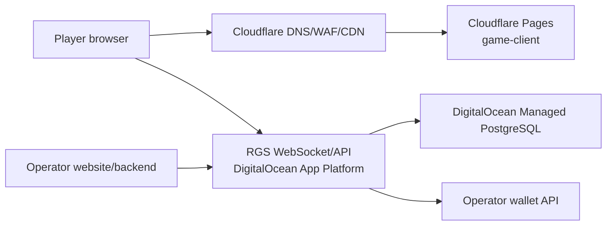

# Production Deployment

Recommended production shape for the current Yantra Gaming RGS and Lempi Crash:

- `apps/game-client`: Cloudflare Pages
- `apps/rgs-server`: DigitalOcean App Platform web service
- Postgres: DigitalOcean Managed PostgreSQL
- DNS, TLS, WAF, CDN, bot controls: Cloudflare
- Operator wallet: your casino/backend infrastructure

This is the lowest-maintenance path for the current codebase. It keeps the
existing Bun, Express, Socket.IO, Prisma, and Postgres architecture intact while
avoiding server patching and hand-managed process supervisors.

## Why This Topology

Cloudflare Pages is a good fit for the PixiJS game client because it is static
after build. DigitalOcean App Platform is a good fit for the RGS because the RGS
is a long-running WebSocket service. DigitalOcean Managed PostgreSQL keeps the
money-path ledger, rounds, bets, credentials, retry queue, and audit records in
a managed database with backups and scaling.

Do not deploy the current RGS directly to Cloudflare Workers unless you plan a
backend rewrite. Cloudflare Durable Objects are a strong option for future
round-coordination architecture, but the current server is not a Workers-native
application.

Avoid a single Droplet for production unless you explicitly want to manage OS
patching, Docker upgrades, backups, firewalling, deploy scripts, monitoring,
restart policy, and incident recovery yourself.

## Production Architecture



The operator website never places bets directly. It creates a signed launch
session with the RGS, embeds or redirects to the game client, and implements the
wallet callback API.

## Components

### Game Client

Build command:

```bash
bun install --frozen-lockfile
bun run build:client
```

Deploy output:

```text
apps/game-client/dist
```

Production env:

```text
VITE_RGS_BASE_URL=https://rgs.example.com
VITE_RGS_SOCKET_URL=https://rgs.example.com
```

Use Cloudflare Pages for the static client. Set the production game URL as the
RGS `GAME_CLIENT_BASE_URL`.

### RGS Server

Build command:

```bash
bun install --frozen-lockfile
bun run build:rgs
```

Start command:

```bash
cd apps/rgs-server && bun dist/index.js
```

Health checks:

| Path | Purpose |
| --- | --- |
| `/healthz` | Process liveness |
| `/readyz` | DB and engine readiness |
| `/metrics` | Prometheus metrics |

Set the App Platform health check to `/readyz` on port `4500`.

### Database

Use DigitalOcean Managed PostgreSQL, not the dev database type, for production.
Run migrations as a deployment job before the RGS release goes live:

```bash
cd apps/rgs-server
bunx --bun prisma migrate deploy
bun run seed
```

The seed script creates or updates the known operator and game configuration
rows. In production, replace mock operator credentials and wallet URLs with the
real operator values before accepting traffic.

## Required RGS Environment

| Variable | Production value |
| --- | --- |
| `DATABASE_URL` | Managed Postgres connection string |
| `SESSION_JWT_SECRET` | Random 32+ byte secret |
| `PORTAL_JWT_SECRET` | Random 32+ byte secret |
| `SECRETS_MASTER_KEY_B64` | Exactly 32 random bytes, base64-encoded |
| `PORT` | `4500` |
| `NODE_ENV` | `production` |
| `GAME_CLIENT_BASE_URL` | Public Cloudflare Pages game URL |
| `CORS_ORIGIN` | Comma-separated production origins |
| `WALLET_CALL_TIMEOUT_MS` | Start with `5000` |
| `MOCK_WALLET_CALLBACK_URL` | Public operator wallet callback base; required if deploy runs `bun src/seed.ts` |
| `SIGNATURE_WINDOW_SECONDS` | Start with `30` |

Generate secrets:

```bash
openssl rand -base64 48
openssl rand -base64 32
```

Store secrets in App Platform encrypted env vars or an external secret manager.
Do not commit production secrets into `.env` files.

## Lempi Production Config

For Lempi Crash, the production game config should be:

| Field | Value |
| --- | --- |
| `gameCode` | `lempi-crash` |
| `displayName` | `Lempi Crash` |
| `currency` | `HNL` |
| `jurisdiction` | `HN` |
| `minBetMicro` | `1000000` |
| `maxBetMicro` | `10000000000` |
| `bettingWindowMs` | `8000` |
| `rtp` | `0.99` |
| `maxMultiplier` | `1000` |

Yantra wire amounts use 100,000 micro-units per major currency unit. For this
HNL config, `L10` is `1_000_000`.

## Website Integration

The production lifecycle is:

1. Player opens your website.
2. Your backend authenticates the player and checks KYC, AML, responsible gaming,
   and account status.
3. Your backend signs and sends `POST /v1/session` to the RGS.
4. The RGS returns a launch URL for `apps/game-client`.
5. Your website embeds the launch URL in an iframe or redirects the player.
6. The game client connects to the RGS over Socket.IO.
7. When money moves, the RGS calls your wallet:
   `/wallet/balance`, `/wallet/bet`, `/wallet/win`, and `/wallet/rollback`.
8. Lempi cashouts credit through the existing `/wallet/win` endpoint,
   referencing the original bet transaction.

Set `sessionTtlSeconds` on `POST /v1/session` when you need a custom launch
credential lifetime. The RGS defaults to 4 hours and caps requests to the
5-minute to 8-hour server policy range; `rgLimits.sessionTimeSeconds` remains
separate and should only be used for responsible-gaming time limits.

The wallet API and signing rules are documented in:

- [integration-guide.md](./integration-guide.md)
- [wallet-api.md](./wallet-api.md)
- [webhook-signature.md](./webhook-signature.md)
- [fx-and-currency.md](./fx-and-currency.md)

## Cloudflare Settings

Use Cloudflare for:

- DNS and TLS
- WAF managed rules
- DDoS protection
- CDN for the static game client
- Optional Turnstile on session creation

Recommended headers:

```text
Strict-Transport-Security: max-age=31536000; includeSubDomains; preload
X-Content-Type-Options: nosniff
Referrer-Policy: no-referrer
Permissions-Policy: camera=(), microphone=(), geolocation=()
```

Configure `frame-ancestors` so the game can only be embedded by approved
operator domains.

## Scaling

For a one-page launch with up to roughly 1,000 concurrent players, start with:

- One RGS instance
- Dedicated CPU App Platform plan
- Managed Postgres in the same region
- Server multiplier ticks at a controlled rate, for example `10-20` per second

The current engine is safest as a single RGS instance because one process owns
the live crash loop for each `(operatorId, gameCode, currency)` tuple. Before
horizontal scaling, add a shared coordinator such as Redis plus Socket.IO
adapter, or a database/lock-backed shard owner, so only one process runs each
live round.

Scale vertically first. Add horizontal scaling only after round ownership,
sticky sockets, and crash recovery are tested under load.

## Deployment Checklist

Before first production traffic:

- Run `bun test tests/plugin-contract`.
- Run `bun test tests/games/lempi-crash`.
- Run targeted integration tests for manual cashout, auto cashout, duplicate
  cashout, wallet-win retry, rollback, and crash recovery.
- Run `bun run build:rgs`.
- Run `bun run build:client`.
- Run `prisma migrate deploy` against production.
- Verify `lempi-crash` HNL config in the database.
- Verify CORS only allows production domains.
- Verify the operator wallet rejects invalid HMAC signatures.
- Verify wallet idempotency for bet, win, and rollback transactions.
- Run a load test with realistic WebSocket concurrency before launch.

## Operations

Monitor at minimum:

- RGS process uptime and restarts
- `/readyz` failures
- Postgres CPU, memory, storage, connection count, and slow queries
- Wallet call latency and error rate
- Pending wallet retry queue depth
- Round recovery events
- Cashout rejection rate
- RTP drift alerts

Back up Postgres automatically and test restore before production launch. Keep
ledger and round records for the retention period required by the operating
jurisdiction.
