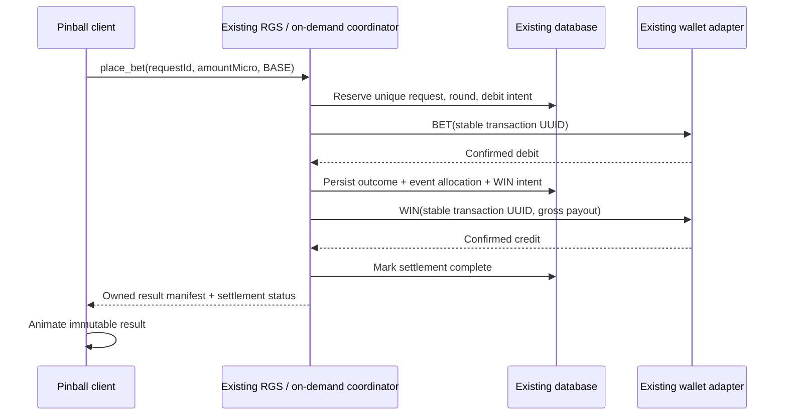
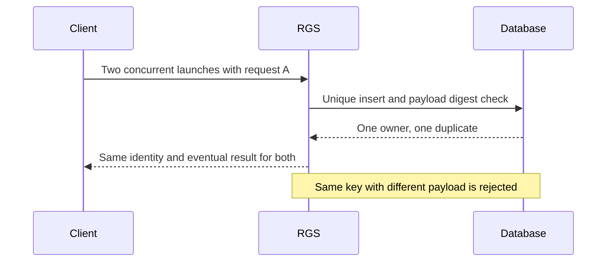
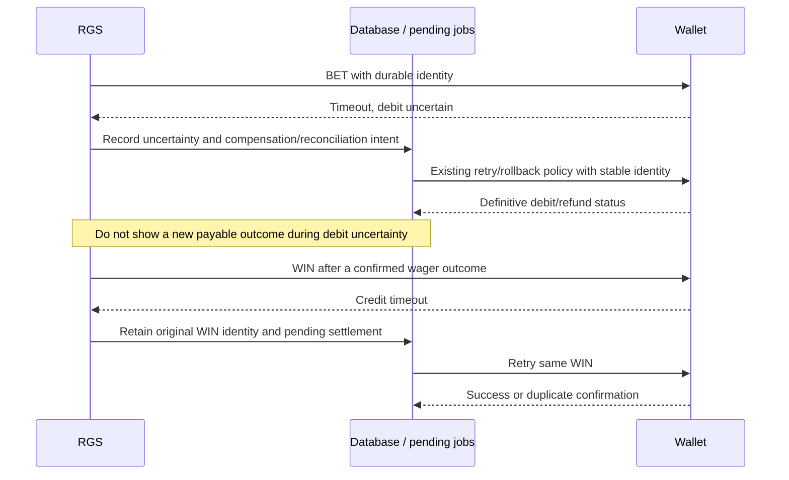
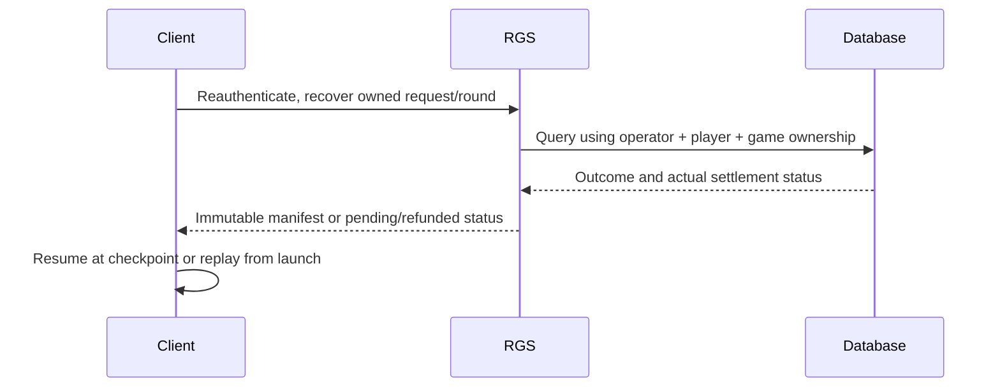
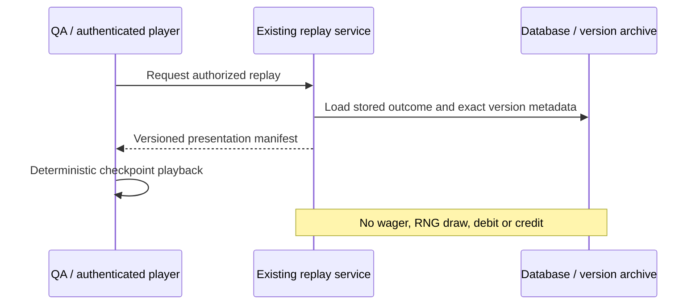

# Pinball After Dark — a new game inside Yantra RGS

Design specification and implementation handoff. Prepared 2026-09-08 at commit `171c6f0`, including existing uncommitted work. Priority P1; effort L; integration risk high because wager lifecycle and settlement are involved. Status: execution approved by the user; implementation and development review complete in `/private/tmp/yantra-pinball-execution` on `codex/pinball-after-dark`; physical-device performance and independent release approval remain open.

## Decision and boundaries

Create `games/pinball-after-dark` implementing Yantra's `GamePlugin`, with a dedicated shell under `apps/game-client/src/pinball`. Run it in `apps/rgs-server`, using existing sessions, wallet contracts/adapters, audit, responsible-gambling gates, operator configuration and certification infrastructure. Keep Bun, TypeScript, Prisma/Postgres, Socket.IO, React, Vite and the already-installed PixiJS 8 stack.

The supplied brief explicitly requests design first and a stop before production implementation. This document supplies that phase. It does not claim validated production math, regulatory approval, trademark availability or finished art.

Working assumptions: independent player-launched rounds; no monetary skill; natural features only; 98% mathematical RTP before monetary quantization; 10,000x gross maximum; all meters reset per wager; 5–10-second ordinary presentation and 15–25-second feature presentation. Timing is a product target, not a statement about jurisdiction requirements. Applicable market rules remain to be selected and verified before launch.

## Repository review and reuse map

Paths below are repository-relative. Repository root: `/Users/julian/Documents/GitHub/yantra-gaming`.

| Existing implementation | Reuse / required adaptation |
|---|---|
| `packages/game-contract/src/index.ts` | Implement `GamePlugin`; use `MultiEventOutcome` (`type: "MULTI"`). Define strict pinball event schemas locally instead of widening the core to know every bumper. |
| `apps/rgs-server/src/games/registry.ts` | Add the static plugin import and registry entry, plus its workspace dependency in the RGS package. |
| `games/ketapola-dice/src/{index,config,outcome,selection,settle}.ts` | Follow the package structure, strict schema validation and pure outcome/settlement split. |
| `packages/rng-core/src/index.ts` | Reuse cryptographic seed creation and deterministic HMAC primitives. Add game-specific domain-separated expansion and rejection sampling inside the new game. |
| `apps/rgs-server/src/services/SessionService.ts`, `middleware/session-auth.ts` | Existing launch/session/authentication path; preserve operator, player, currency and game binding. |
| `services/EngineRegistry.ts`, `services/GameEngine.ts` | Reuse the RGS execution boundary, but introduce an on-demand round mode. Existing shared timed rounds do not provide one independent ball per wager. |
| `wallet/WalletClient.ts`, wallet adapters, `services/PendingJobRunner.ts` | Reuse bet, win, rollback, retries and correlation. Harden operation durability for the new execution mode. |
| `services/RGLimitsEnforcer.ts`, `GlobalKillSwitch.ts`, `BuildAttestation.ts` | Preserve validation and operational gates before accepting wagers. No bypass for this game. |
| Prisma `Round`, `Bet`, pending jobs and wallet-call records | Persist outcome and settlements here; extend metadata and request uniqueness rather than introduce a second ledger. |
| `routes/rounds.ts`, `services/ProofService.ts`, `DisputePack.ts` | Reuse history/operator replay; fix historical config lookup and seed disclosure before relying on them for pinball. |
| `apps/game-client/package.json` | Already includes PixiJS `^8.6.0`, Vite, React, GSAP, Howler, Zustand and i18next. No stack migration. |
| `apps/game-client/src/App.tsx` | Add a game-code shell alongside Lempi and existing RPS work; reuse bootstrap, session store and iframe messaging. |
| `tests/plugin-contract/plugin-conformance.spec.ts` | Registry-driven contract checks already pass; pinball joins this harness. |
| Existing game PAR sheets, RNG fixtures, `scripts/export-cert-packet.ts` | Follow their artifact conventions and extend packet inclusion for the new game. |

### Material gaps confirmed in code

1. **Round scheduling** — `EngineRegistry.keyFor` groups by operator/game/currency; `GameEngine.runLoop` repeatedly opens betting, reveals one outcome and settles a shared round. `computeOutcome` is called once per shared round. Simply registering pinball would give players a shared machine result. Add an opt-in on-demand coordinator inside the existing server; keep timed engines on their current mode.
2. **Wager retry identity** — `gameSocket.ts:35` accepts amount/selection/autoplay/turbo without a client request identifier; `GameEngine.placeBet` creates fresh UUIDs for a bet. Wallet-level idempotency does not deduplicate a retried launch. Add a durable request key scoped to operator/player/game, bind a payload digest, and return the original result on retry; conflicting payloads must fail.
3. **Historical math** — `Round.gameConfigVersion` records a label, while `routes/rounds.ts:301` fetches current `OperatorGameConfig`; recovery in `GameEngine.resumeUnsettledRounds` uses current `this.gameConfig`. Store an immutable config snapshot/hash and game/math/presentation versions per round, and dispatch historical verification through retained versions.
4. **Seed lifetime** — `GameEngine.getOrCreateEngineSession` reuses a seed across rounds; `ProofService.forRound` and the replay route reveal it once an individual round is terminal. That is too early while future rounds still use that seed. Gate disclosure on seed retirement across every endpoint. For pinball use a committed seed chain/rotation policy whose retired keys cannot determine future accepted outcomes. Serialize nonce allocation and make it durable.

These are high-confidence integration findings, not a complete security audit. Each requires targeted tests; the scheduling change is L/high risk, request durability and historical metadata M/high risk, seed retirement M/high risk. Existing RPS, wallet, schema, socket and App edits are present and must be preserved. Broader admin, infrastructure and tournament security were not audited.

## Game concept and core loop

An illicit arcade technician has rebuilt a cabinet from scavenged electronics. Cyan bumper lamps, amber relay banks, magenta ramps and scratched enamel establish an original machine identity. The player stakes, launches and watches a server-resolved journey. Flippers and nudges are presentation only, with no implied ability to improve payout.

The server chooses a bounded, weighted scoring itinerary before animation. Every illuminated scoring collision in that itinerary is a real award or a clearly labelled state change. Non-scoring wall contacts remain physical decoration. No artificial jackpot near misses are added to losing paths.

1. Session authenticates and obtains approved config, stake limits and a seed commitment.
2. Launch sends a strict selection `{mode: "BASE"}`, amount as an integer micro-unit string, and stable request ID.
3. RGS reserves the request and round identity, validates limits, and records a durable debit intent.
4. Confirmed debit permits deterministic resolution; RGS persists the entire outcome and settlement intent.
5. Wallet credit happens independently of animation. A credit timeout means pending settlement, not a new outcome.
6. Client interprets the manifest, animates the ball, and displays gross return and net change distinctly.
7. On reconnect, fetch the owned round and resume or replay. A completion notification can record telemetry, but never controls payment.

Client state: `BOOT → LOADING → READY → REQUESTING_RESULT → BALL_LAUNCH → PLAYING ↔ FEATURE_TRANSITION/MULTIBALL → WIN_PRESENTATION → ROUND_COMPLETE → READY`. Any network uncertainty enters `ERROR_RECOVERY`, which resolves the existing request before enabling a new wager. Wallet status is server state and remains separate from presentation state.

## Board

Logical board: 720 × 1280, scaled uniformly into the viewport; safe areas surround the controls.

```text
+------------------------------------------------+
|       SCORE / GROSS RETURN / ROUND MULTIPLIER   |
|  [L1] [L2] [L3] rollover awards       [PLUNGER]|
|   +---------- UPPER DECK ------------------+  ^|
|   | [J] FUSE VAULT       [K1][K2][K3] LOCK |  ||
|   | [H] HIGH-VOLTAGE COLLECTOR             |  ||
|   +------ [G] ROTATING ROUTE GATE ---------+  ||
| [R1] MULTIPLIER RAMP       [R2] RETURN RAMP   ||
|         (A)       (B)       (C) BUMPERS       ||
|                                                |
| [T1][T2][T3][T4][T5] CASH DROP TARGETS          |
|             [S] RELAY SPINNER                  |
|  [Q] CHARGE METER       [E] ECHO SCOOP          |
|    sling / visual flipper   visual flipper     |
|                    DRAIN                      |
+------------------------------------------------+
```

Lanes, bumpers, targets, spinner, scoop, collector and vault can award. Ramps/gate/locks/meter change state unless the manifest explicitly assigns them an award. No progressive jackpot pool: the vault is a fixed-pay feature in v1.

## Eight award systems and modifier rules

All values below are expressed in stake units. The reviewed itinerary table, not free-running client collisions, determines occurrence and value.

| System | Defined behavior |
|---|---|
| Lane awards | A rollover adds its explicit base award. |
| Combo bumpers | A/B/C hits award their current listed value; repeated hits may raise a subsequent hit's level. Level-up itself pays zero. |
| Relay combo | Completing an authored distinct-object sequence adds one separately recorded combo award. |
| Cash target bank | Each drop target adds an award; a completed bank can unlock the route gate without paying again. |
| Spinner burst | A bounded count of paid pulses, with one event per pulse or a clearly itemized aggregate. |
| Echo scoop | Repeats one eligible prior base award once; never repeats another echo or recursively doubles a multiplier. |
| Upper-deck collector | Awards a listed collector value, multiplied by the current round multiplier. It does not re-award the accumulated total. |
| Fuse vault / multiball jackpots | Paid vault strikes from one or three balls; each strike has one owner and one award event. Ball locks themselves pay zero. |

Multiplier rails modify **future** eligible awards only. Suggested state ladder: 1, 2, 4, 8. No retroactive multiplication of the accumulated pot. Overdrive changes the next eligible object's explicit local factor, consumed once. Route gates unlock higher-value objects. Three locks within the same round activate three balls; no paid extra wager and no cross-round saved progress.

For an award event, effective units = base units × round factor × explicitly authorized local factor. Factors are positive integers and bounded by the reviewed itinerary. The event records all three values and its final rational award. A bounded table guarantees the 10,000x maximum without clipping afterward.

## Signature candidates

Scores are design judgments on a 1–5 scale, not research findings or trademark clearance.

| Candidate | Description | Fun | Clarity | Novelty | Math control | Animation |
|---|---|---:|---:|---:|---:|---:|
| Relay Ladder | Bumper → target → spinner charges the next award; repeated category resets the chain | 4 | 5 | 3 | 5 | 5 |
| Fuse Handoff | A charged ball transfers one stored factor to an upper-deck collector and consumes it | 5 | 4 | 4 | 5 | 5 |
| Echo Pocket | Scoop repeats a visibly identified earlier base award once | 4 | 5 | 3 | 5 | 4 |
| Crosswire | Two multiball routes jointly enable one labelled collector factor | 5 | 3 | 4 | 4 | 5 |
| Cabinet Shift | A relay rotates the upper deck route, changing which award objects are reachable | 4 | 4 | 4 | 4 | 5 |

Recommend Relay Ladder, Fuse Handoff and Echo Pocket. Cabinet Shift supplies route presentation; defer Crosswire until three-ball readability is demonstrated. None of these names is claimed to be legally exclusive.

### Interaction matrix

`Y` = permitted, `—` = not combined in v1. Every permitted combination still needs an explicitly enumerated itinerary.

| Award | Round rail | Relay bonus | Overdrive local factor | Echo source | Multiball |
|---|---|---|---|---|---|
| Lane | Y | — | — | Y | Y |
| Bumper | Y | Y | Y | Y | Y |
| Combo | — | — | — | — | Y |
| Target | Y | Y | Y | Y | Y |
| Spinner | Y | Y | — | Y | Y |
| Echo | Y | — | — | — | Y |
| Collector | Y | — | Y | — | Y |
| Vault | Y | — | Y | — | Y |

Echo copies the unmodified source base then applies its own current rail once. Relay completion has a standalone award; modifier increments have no separate cash contribution. Multiball does not multiply all money by three; it introduces three identified ball streams.

## Initial mathematical architecture

Use a finite weighted set of complete legal itineraries. A sampled row defines both scoring events and their exact total. Cosmetic route alternatives within a row must preserve event targets, factors and awards. This is result-first, but the score is still the sum of the machine's actual specified interactions, not a payout invented by animation.

The following is an **initial marginal distribution for review**, not a validated complete game configuration. The final itinerary library must preserve this distribution or regenerate the PAR report. It makes the target and volatility concrete while leaving feature allocation honest.

| Gross multiplier | Integer weight / 1,000,000 | Probability | RTP contribution |
|---:|---:|---:|---:|
| 0 | 650,000 | 65% | 0 percentage points |
| 0.6 | 200,000 | 20% | 12 pp |
| 2 | 100,000 | 10% | 20 pp |
| 5 | 40,000 | 4% | 20 pp |
| 20 | 9,000 | 0.9% | 18 pp |
| 100 | 900 | 0.09% | 9 pp |
| 1,000 | 90 | 0.009% | 9 pp |
| 10,000 | 10 | 0.001% | 10 pp |
| **Total** | **1,000,000** | **100%** | **98 pp** |

Exact arithmetic checked locally: expected multiplier = 49/50 = 0.98. Variance = 2,757,779/2,500 = 1,103.1116; standard deviation ≈ 33.2131 stakes. Nonzero return frequency 35%; profitable-return frequency 15%; median return 0; maximum frequency 1 in 100,000. These are mathematical consequences of this proposal, not empirical results. A large share of EV comes from rare awards: at 100,000 rounds, approximately 37% of runs would see no maximum event under the independent model.

For a first itinerary allocation, ordinary rows through 5x supply 52 RTP points, enhanced routes at 20x supply 18, and multiball rows from 100x supply 28. If all 100x+ rows use three locks, multiball frequency is 0.1%, or 1 in 1,000. Route feature frequency including multiball is 1%. These assignments are provisional product decisions, not additional independent rolls.

**Do not invent eight independent RTP budgets and multiply them together.** For mechanic-level reporting, each final award has one owner (the eight systems above). Compute `sum(probability × event award)` by owner across all complete itineraries. Track multiplier uplift separately as an analytical decomposition, never add it again to awarded RTP. Actual mechanic contributions remain unvalidated until the itinerary library is written and enumerated. Feature frequencies follow the same full-row enumeration.

Store rational awards in integer millionths of stake. Settle with BigInt micro-units. To keep the event ledger equal to the total after flooring, assign each event `floor(stake × cumulativeUnits / 1,000,000) − floor(stake × previousCumulativeUnits / 1,000,000)`. This avoids independent event-rounding loss. Record the allocated values alongside the immutable payout manifest. For allowed stake increments making all payouts exact, RTP is 98%; otherwise report the stake-specific quantization effect and choose permitted increments deliberately. Reject nonzero per-bet commission for this math profile: silently deducting commission would change player RTP.

Config layout inside the game: `src/math/{paytable,probabilities,features,rtp}.ts`, an immutable versioned itinerary table, and `simulation/`. The math profile chooses a reviewed table by ID/hash. Operators must not independently edit payout weights under the same math version.

Simulator deliverable: `bun run math:simulate -- --rounds 1000000` (new root script; npm-compatible script alias may call Bun). Support 100k, 1m, 10m and 100m, streaming counters rather than storing rounds. Report bets, returned money, theoretical and observed RTP, owner contributions, feature frequencies, profitable/nonzero hit rates, median/mean/stddev, max, percentiles and requested buckets. Use disjoint buckets `{0}`, `(0,1)`, `[1,2)`, `[2,5)`, `[5,10)`, `[10,50)`, `[50,100)`, `[100,1000)`, `[1000,∞)`.

Generate JSON and Markdown PAR reports from the same model, with distribution, weights, EV, second moment, max exposure, feature counts, model hash, seed/test mode and confidence estimates. Validate exact enumeration first; use Monte Carlo to catch implementation drift, not to establish the theoretical target. No simulation has been run in this design phase.

## Example rounds

These are proposed itineraries consistent with the marginal outcomes; they are not certified fixtures. Use a 1-unit stake (100,000 wallet micro-units; payout-ratio SCALE is independently 1,000,000) and zero commission. Each line contributes once.

| Example | Server scoring sequence | Exact gross / net |
|---|---|---|
| Losing | Launch → unlit wall contacts → drain; no scoring events | 0 / −1 |
| Small return | Lane 0.10 + bumper A 0.20 + target 0.30 | 0.60 / −0.40; neutral return presentation |
| Medium | A 0.20 + B 0.30 + combo 0.50 + rail to 2 + target (0.50 × 2) | 2.00 / +1.00 |
| Big | Lane 0.20 + A 0.30 + target 0.50 + rail to 2 + collector (2 × 2) | 5.00 / +4.00 |
| Enhanced | A 0.50 + target 0.50 + combo 1 + rail to 2 + collector (4 × 2) + vault (5 × 2) | 20.00 / +19.00 |
| Multiball | Opening bank 5 + three zero-pay locks + rail to 2; balls 1/2/3 vault bases 10/15/20; echo base 2.5 | 5 + 20 + 30 + 40 + 5 = 100 / +99 |
| Massive | Opening bank 10 + rail to 2 + collector (45 × 2) + three locks + rail to 4 + vault (225 × 4) + overdrive ×2 local + rail to 8 + final vault (562.5 × 8 × 2) | 10 + 90 + 900 + 9,000 = 10,000 / +9,999 |

Any aggregate “bank” in this table must be expanded into individually labelled target awards in the implementation. A 1,000x row and all permitted variants still require explicit itineraries during M0.

## Outcome, RNG and money contract

`computeOutcome(ctx, config)` stays pure and wager-independent, matching the existing contract. Its `MULTI.baseGame` holds `gameCode`, `gameVersion`, `mathVersion`, `mathHash`, `manifestVersion`, `presentationVersion`, itinerary ID and total integer stake units. Each ordered event has a unique index, ball ID, object ID, type, base units, factors, effective units and state transitions in a strictly validated `subOutcome`.

Do not put bet-specific `payoutMicro` into a shared pure outcome. `settleBet` converts units for its actual stake; the on-demand coordinator persists a bet-specific event allocation and gross total before credit. Keep wire `outcomeType: "MULTI"` to satisfy the existing conformance harness, and discriminate pinball through gameCode/manifest metadata.

The presentation plan contains checkpoint/path IDs and a separate version. Timestamps and easing live in a versioned client interpreter. A cosmetic public seed may vary spark positions, but must be independent of the secret monetary seed and cannot change the event sequence. Replay loads stored data and never asks for a new outcome.

Use existing cryptographically generated server secrets as HMAC keys; deterministic HMAC with a secret key is appropriate for the current provably-fair architecture. The brief's “seeded RNG only in tests” must not cause replacement of Yantra's cryptographic commitment scheme with browser randomness. A separate simple seeded simulation generator remains test-only.

Pinball expansion uses unambiguous domain-separated HMAC input containing game code, math version, client seed, nonce, draw purpose and block counter. Document exact byte encoding. Never borrow future round nonces for sub-events. For total weight W ≤ 2^32, accept uint32 samples below `floor(2^32/W) × W`, then map `% W`; rejected values consume a fresh sample. Include rejection-boundary vectors. Production outcome selection never calls `Math.random()`.

At round reservation pin the config snapshot, seed reference, nonce and immutable versions. Enforce uniqueness in the database. Do not reveal a key until it is retired and no future/reserved outcomes can use it. Player-safe replay exposes the outcome, never live secrets or operator credentials.

## RGS sequences — proposed extension, not existing behavior

Reuse existing launch/session routes and Socket.IO. Extend `place_bet` with an idempotency key for the on-demand mode rather than create the brief's second set of `/session` and `/round/start` endpoints. Existing `/v1/rounds/:id` and replay are operator-authenticated: add an authenticated session-scoped result read for the owning player; do not embed operator keys in the browser. Verify route mounts during implementation.

### Normal round



For zero return, record resolved loss with no positive credit operation. Wallet rejection produces no playable paid manifest.

### Client timeout

```mermaid
sequenceDiagram
  participant C as Client
  participant R as RGS
  participant D as Database
  C->>R: Launch with request A
  Note over C,R: Response lost
  C->>R: Retry request A / query request A
  R->>D: Read durable request and status
  D-->>R: Original round or pending status
  R-->>C: Same round; never a second wager
```

### Concurrent duplicate



### Wallet failure and recovery



The debit-uncertain and credit-uncertain paths describe separate cases. An unresolved credit must never cause a reroll or a conflicting refund. Pending jobs plus state changes require durable atomic intent creation; an external wallet call cannot be part of a local database transaction. The guarantee is one financial effect through stable identities and wallet idempotency, not one network call.

### Reconnection



### Replay



Internal proof verification may recompute using a retired seed and original configuration; presentation replay itself only reads the recorded manifest. Seed retirement must also be enforced by dispute exports and history.

## Frontend and physics

Add a lazily loaded `PinballShell` selected by launch `gameCode`. Reuse session initialization, expiry/offline UI, parent messaging, locale, balance conventions and error boundary. Give pinball its own state store and manifest interpreter; existing dice hooks/store contain game-specific assumptions and should not drive pinball by accident.

Pixi hierarchy: `Application → PinballScene → {cabinet, playfield, objects, inserts, ramps, balls, effects, labels}`. Keep React controls and accessible bet/balance/rules outside the canvas. World containers use fixed logical coordinates; UI is responsive independently.

Systems: asset bundles, board builder, pooled ball controller, manifest validator/interpreter, animation director, named-event audio adapter, pooled effects, win presenter, replay controller and quality manager. Immutable business state feeds these systems; ticker position updates do not re-render React. Pause timers cleanly on hidden tabs, cap delta after resume, and use elapsed presentation time to restore the checkpoint rather than integrate a huge physics step.

| Strategy | Benefits | Costs |
|---|---|---|
| Result-first checkpoint paths | Monetary state separated from rendering; deterministic replay; authored routes and predictable mobile work | Need enough physically plausible paths and validation to avoid visible impossible motion |
| Server seeded physics | Mechanical outcomes derive from physical simulation | Server physics versioning, numeric determinism, collision reproducibility and full probability analysis become part of the mathematical engine |

Recommend result-first. Use authored splines/ballistic segments through exact target checkpoints, with deterministic contact effects. Start without Matter.js. A future physics library can handle non-monetary debris only if it improves visuals within budget. Do not visually strike a paid bumper without its corresponding award; validate path/event alignment and show ball IDs during multiball QA.

## Asset and sound manifest

| Bundle | Required assets |
|---|---|
| Boot/UI | Original title treatment, loading badge, stake/launch/mute/info/replay icons, licensed condensed display and readable body fonts |
| Cabinet | Scratched enclosure, hand-painted original side art, plunger, glass highlight, bezel, screws |
| Playfield | Base texture, two ramps, route gate, flippers, slingshots, drain and upper deck |
| Scoring atlas | Three bumper states/levels, lanes, five targets up/down, spinner, scoop, vault, three locks, charge meter inserts |
| Motion/VFX | Chrome ball and shadow, trails, sparks, shock rings, electrical arcs, bulb chase, gate/target frame sequences |
| Win response | Scoreboard digit set, relay animations, cabinet light patterns; restrained small-return state and escalating profitable-win states |
| SFX | Spring launch, rolling loops, rubber/metal collisions, target drop, spinner, ramp, lock, relay, scoop, vault, drain, UI feedback |
| Music | Sparse base loop, charge layer, multiball layer, peak stinger and release tail; independently mixable stems |
| Voice | Optional original announcer launch/lock/overdrive/vault calls, recorded or licensed with provenance |

Map audio to named manifest events. Bumper sequences can raise pitch within a bounded range; a multiplier adds a layer; multiball changes the mix; major awards briefly duck music. Unlock audio on user gesture; persistent mute, reduced motion and limited voice repetition. Artwork, fonts and recordings need an asset/license manifest. Initial greybox uses code-drawn board geometry; production art follows approved board readability.

## Mobile performance budgets

Proposed budgets, not measured results: 60 fps with p95 frame time ≤16.7 ms on the agreed mid-range device; low tier 30 fps with p95 ≤33.3 ms. Portrait 360 CSS px remains usable, with landscape/desktop letterboxing or side HUD. No required bloom/filter pass on low tier.

Initial compressed JS ≤600 KB for the pinball route including its share of libraries; initial art/audio download ≤4 MB; optional feature bundles ≤8 MB additional. GPU texture budget ≤64 MB low / ≤128 MB high; decoded audio ≤24 MB low / ≤48 MB high. Target ≤60 draw calls low / ≤100 high; pooled particles ≤80 low / ≤300 high; cap device-pixel ratio at 1.5 low / 2 high.

Measure bundled/compressed JS with Vite output, transferred bytes in browser network tooling, texture dimensions × format bytes, active audio buffer sizes and per-frame counters. Test throttled networks, reconnect during launch and three simultaneous balls on a named low-end Android device. If real measurements exceed budget, simplify textures/filters/particles before raising it. Reduced motion removes shake, flashes and camera movement without concealing awards.

## Implementation milestones and verification

Work remains inside this monorepo. Future branch convention: `codex/pinball-after-dark`. Before edits, inspect `git status --short` and `git diff --stat 171c6f0..HEAD`; this plan also depends on uncommitted RPS/wallet work, so commit comparison alone is insufficient. Preserve that work and reconcile overlapping files explicitly.

Follow TypeScript modules and strict Zod schemas from existing games; use `bun:test`, BigInt money and existing wallet result handling. Do not install a second application framework. React implementation should consult the available React performance skill.

| Milestone | Files / concrete work | Verification gate |
|---|---|---|
| M0 Math and plugin | New `games/pinball-after-dark/{src,simulation,fixtures,docs}`, new `tests/games/pinball-after-dark`; enumerate all rows and event totals, weighted RNG, report generator, strict selection/config and settlement | New `bun test tests/games/pinball-after-dark` passes exact EV, all-row totals, max, quantization and RNG vectors; new `bun run math:simulate -- --rounds 1000000` produces reproducible JSON/Markdown reports |
| M1 Existing RGS extension | `game-contract`, registry, RGS dependency, `EngineRegistry`, new on-demand coordinator plus shared execution helpers, socket, Prisma migration, pending recovery, proof/replay | New `bun test tests/integration/pinball-rounds.spec.ts` passes using isolated test DB; existing `bun test tests/plugin-contract` passes all games |
| M2 Greybox | `apps/game-client/src/pinball/{board,animation,replay}`, App shell routing | `bun run build:client` exits 0; every manifest fixture reaches its intended scoring objects without extra scored contacts |
| M3 End-to-end | Pinball store, socket adapter, stake/balance/rules UI, session-owned recovery reads; operator catalog/seed fixture using existing config patterns | Isolated integration suite verifies debit → outcome → credit and reconnect; logged gross/event sum/net match wallet micro-units |
| M4 Feature coverage | Complete target bank, rails, gate, locks, meter, signature mechanics and multiball presentation | Replay every enumerated feature fixture, three ball IDs and all interaction matrix cases; screenshot/video review at portrait/landscape |
| M5 Art | New pinball assets and provenance manifest, atlases and lazy bundles | Client build passes; asset/license inventory complete; network/GPU budgets measured |
| M6 Audio/VFX | Named audio adapter, music stems, quality profiles, reduced-motion behavior | Device frame/audio budgets measured; mute, background/resume and autoplay restrictions tested |
| M7 Balance | Versioned itinerary adjustments after design review; regenerated PAR and RNG fixtures | Run 100k/1m/10m/100m simulation modes; compare against exact moments and variance-aware confidence bounds, not a fixed small RTP tolerance |
| M8 Resilience/security | Crash-point tests, concurrency, state transitions, ownership, input validation and immutable-version recovery | `bun test tests/integration` on isolated DB and plugin/game tests pass; no duplicate financial effect under repeated delivery |
| M9 Review package | Game rules, PAR JSON/Markdown, RNG spec/vectors, versioned manifests, security/recovery evidence and existing cert export integration | `bun run cert-packet` after required local setup; verify game inclusion and exact hashes; independent review remains a separate release condition |

M1 is not “build a new RGS.” It supplies the on-demand lifecycle the new game needs while using the existing server infrastructure. Keep timed games' behavior compatible and add characterization tests before extracting shared settlement helpers.

Existing commands confirmed from repo scripts: `bun test tests/plugin-contract`, `bun run test:math`, `bun run test:integration`, `bun run build:rgs`, `bun run build:client`, `bun run check`. The new commands and tests above are implementation deliverables, not commands claimed to exist today. Repo requires Bun ≥1.3.10; this review environment ran Bun 1.2.9, so the passing contract baseline is useful but is not a supported-runtime release check.

Do not run the integration harness on the developer database: `tests/README.md` warns that tests can truncate tables. Establish a dedicated database and generate/migrate its schema first. No integration or live wallet test was run during this review.

### Required invariants and tests

- Every configured itinerary has integer weights, legal state transitions, bounded factors and a total ≤10,000x; total event units equal its declared total.
- Gross micro-unit payout equals the sum of event allocations for every allowed stake; no float conversion; negative, malformed and excessive amounts rejected.
- Round `won` must retain the engine's payable-return semantics if needed for crediting 0.6x; presentation uses `gross > stake` separately to decide a profitable celebration. Never suppress a legitimate sub-stake credit as a “loss.”
- Concurrent repeated launch request, reconnect and process restart preserve the original bet/debit/credit identity. Different body under the same key is rejected. Deduplication lookup must precede creating any new wager.
- Inject crashes before/after debit call, debit acknowledgment persistence, outcome persistence, credit intent, credit call and job completion. Recovery makes exactly one debit and at most one correct gross credit, or a confirmed refund when no outcome was committed.
- Config change and binary deployment during a pending round do not change its result, payout or replay. Old code/math remain available by immutable hash/version.
- No current seed escapes via proof, history, replay, socket or dispute export; retired-seed verification matches fixtures.
- Cross-player/cross-operator round reads fail; session expiry, kill switch, currency/stake/RG gates apply to the new mode.
- Presentation completion/tampered score/ball position cannot modify settlement; a duplicate replay never triggers wallet/RNG work.
- Shared dice/crash games retain their existing loop/contract behavior. Use existing plugin tests plus new lifecycle regression tests, not only static typechecks.

Stop implementation and report if the working tree has incompatible overlapping edits, a round cannot pin historical math, the wallet cannot honor stable transaction identities, or any paid manifest can leak before wager acceptance. Do not compensate by rerolling, silently changing math or disabling validation. Do not fabricate certification hashes/status to pass startup gates; use the documented test-mode setup for development.

## Product decisions for review

1. Confirm independent on-demand rounds. A shared timed pinball game is cheaper to integrate but changes the requested product.
2. Confirm 98% as the commercial target and how supported stake increments preserve it after rounding.
3. Approve or change this high-volatility shape: 65% zero returns, 20% sub-stake returns, 10,000x at 1 in 100,000. It is a concrete initial proposal, not an optimized final distribution.
4. Confirm zero monetary control, natural features only and round-local meters; feature buys, real flippers or cross-round persistence require a separate reviewed model.
5. Select launch jurisdictions, currency precision/stakes, jurisdiction timing rules, exposure ceiling and device matrix.
6. Approve the original underground cabinet identity, working title and optional announcer; obtain naming/art/audio clearance before production release.
7. Confirm ordinary/feature duration and replay/skip behavior. Skipping presentation cannot bypass applicable server timing or initiate a second unresolved wager.
8. Approve the three signature mechanics and the frequency/readability of multiball before authoring the full itinerary library.

## Review evidence and completion

Read the actual plugin contract/registry, RNG core, engine lifecycle/bet/recovery paths, seed/proof/replay code, schema, client routing/dependencies and representative tests. Ran `bun test tests/plugin-contract`: **19 pass, 0 fail**. Independently checked the proposed probability weights, expected value and variance with exact rational arithmetic. No Monte Carlo, UI performance measurement, integration test, production code edit or deployment was performed.

This completes the requested design phase. Next work begins with review of the proposed mathematics and on-demand lifecycle, then M0 and M1 in that order.

## Execution review — 2026-09-08

The user approved implementation after the design phase. M0–M9 implementation and development review are complete in the isolated execution checkout; source is uncommitted and has not been merged or deployed. The existing RGS, wallet adapters, session/authentication, recovery queue and audit facilities are reused.

Independent final verification: 84 game/plugin tests (35,538 assertions), 36 focused integration/jurisdiction tests (176 assertions), client and RGS builds, and whitespace checks passed. All eight browser fixtures reached final drain. Actual demo launch, partial-return accounting, reload, replay, responsive 360×800 and 844×390 layouts, dialog focus, sound and reduced-motion controls were checked. Unrelated original working changes match their recorded hashes.

The final 92-artifact review packet is at `/private/tmp/pinball-final-review/pinball-after-dark-cert-packet-2026-09-08T19-49-11-219Z`. Every artifact hash/size and included source correspondence was independently verified. Its isolated math workspace installed without original dependencies and passed 13 math tests (13,868 assertions) and the reproducible 100k simulation. Independent 100m simulation yielded 98.0030094% against exact 98%.

Release gates remain open: provisional desktop p95 was about 24–25 ms versus the proposed 16.7 ms, and named physical-device, GPU/draw-call, network and audio budgets were not verified. Existing full-repository typecheck/wallet-test issues are documented in the game review evidence; this is not a claim that the entire repository suite is green. Production configuration, independent certification and deployment were not performed. See `games/pinball-after-dark/docs/review-evidence.md` in the execution checkout.
